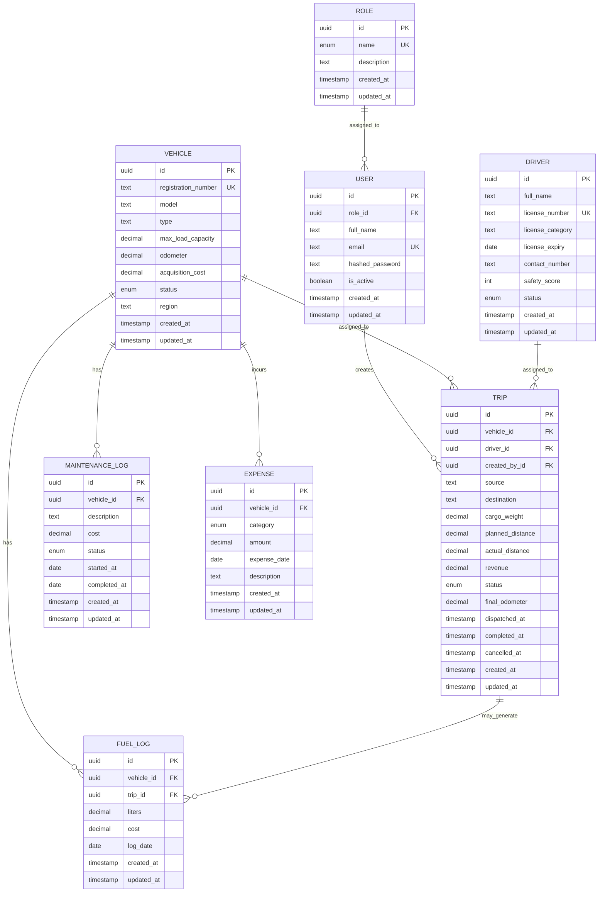

# Database

## ER Diagram

## Schema Decisions

- The database keeps only the required TransitOps entities: `Role`, `User`, `Vehicle`, `Driver`, `Trip`, `MaintenanceLog`, `FuelLog`, and `Expense`.
- Primary keys are UUIDs.
- One `User` has exactly one required `Role`; there is no `UserRole` join table.
- `User` is the login identity. `Driver` is the operational driver profile with license and safety data.
- `FuelLog.tripId` is optional so fuel can be logged against a vehicle without tying it to a trip.
- Status and category fields use Prisma enums instead of free text.
- Database table and column names are mapped to snake case while Prisma code uses camel case.

## Enums

- `RoleName`: `SUPER_ADMIN`, `FLEET_MANAGER`, `DRIVER`, `SAFETY_OFFICER`, `FINANCIAL_ANALYST`
- `VehicleStatus`: `AVAILABLE`, `ON_TRIP`, `IN_SHOP`, `RETIRED`
- `DriverStatus`: `AVAILABLE`, `ON_TRIP`, `OFF_DUTY`, `SUSPENDED`
- `TripStatus`: `DRAFT`, `DISPATCHED`, `COMPLETED`, `CANCELLED`
- `MaintenanceStatus`: `OPEN`, `CLOSED`
- `ExpenseCategory`: `TOLL`, `PERMIT`, `INSURANCE`, `FINE`, `PARKING`, `MAINTENANCE`, `OTHER`

## Database Constraints

- `Role.name` is unique.
- `User.email` is unique.
- `User.roleId` is required.
- `Vehicle.registrationNumber` is unique.
- `Driver.licenseNumber` is unique.
- `Trip.vehicleId`, `Trip.driverId`, and `Trip.createdById` are required.
- `MaintenanceLog.vehicleId`, `FuelLog.vehicleId`, and `Expense.vehicleId` are required.
- `FuelLog.tripId` is optional.

## Service-Level Business Rules

These rules are enforced in services, not directly by the schema:

- Retired, in-shop, or on-trip vehicles cannot be dispatched.
- Suspended, off-duty, on-trip, or expired-license drivers cannot be assigned to trips.
- Cargo weight cannot exceed the assigned vehicle's maximum load capacity.
- Dispatching a trip changes both vehicle and driver status to `ON_TRIP`.
- Completing a trip changes both vehicle and driver status back to `AVAILABLE`.
- Cancelling a dispatched trip changes both vehicle and driver status back to `AVAILABLE`.
- Creating an open maintenance log changes the vehicle status to `IN_SHOP`.
- Closing maintenance changes the vehicle status back to `AVAILABLE` unless the vehicle is retired.
- Status transitions should run inside Prisma transactions.

## Analytics Formulas

- Fuel efficiency: `distance / fuel liters`
- Operational cost per vehicle: `fuel cost + maintenance cost + expenses`
- Vehicle ROI: `(revenue - (maintenance + fuel + expenses)) / acquisition cost`
- Fleet utilization: `vehicles on trip / active non-retired vehicles * 100`

## Seed Data

The seed script creates:

- All required roles.
- One active `SUPER_ADMIN` user.

The initial super-admin seed values come from `SUPER_ADMIN_EMAIL`, `SUPER_ADMIN_PASSWORD`, and `SUPER_ADMIN_FULL_NAME`, with local development fallbacks documented in `.env.example`.
